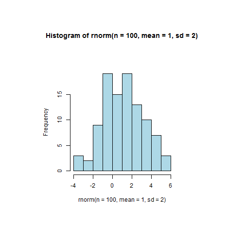

## Definition of 'Central Limit Theorem - CLT'

A statistical theory that states that given a **sufficiently large sample size** from a population with a **finite level of variance**, the mean of all samples from the same population will be approximately equal to the mean of the population. Furthermore, all of the samples will follow an **approximate normal distribution pattern**, with all variances being approximately equal to the variance of the population divided by each sample's size.


```r
rnorm(n=10, mean=0, sd=1) # standard normal
```

```
##  [1] -0.4472  0.5950  0.7846 -0.3337  1.4222  1.5025  1.3259 -1.0143
##  [9]  0.7598 -2.2374
```

--- .class #id 

## R code


```r
par(mar = c(10, 10, 10, 10))
hist(rnorm(n=100, mean=1, sd=2), col='lightblue')
```

 


--- &radio
## Question

What is the parameter of standard normal distribution?

1. (mean = 0, var = 1)
2. _(mean = 0, sd = 1)_
3. (mean = 1, var = 1)
4. (mean = 1, sd = 1)

*** .hint
It is symmetric about the y axis.

*** .explanation
Standard Normal distribution has 0 mean and 1 standard deviation.


--- .class #id 

## Reference

- http://www.math.uah.edu/stat/sample/CLT.html
- [wikipedia](http://en.wikipedia.org/wiki/Central_limit_theorem)
- [shiny interactive histogram](https://berrkim.shinyapps.io/courseproject/)


